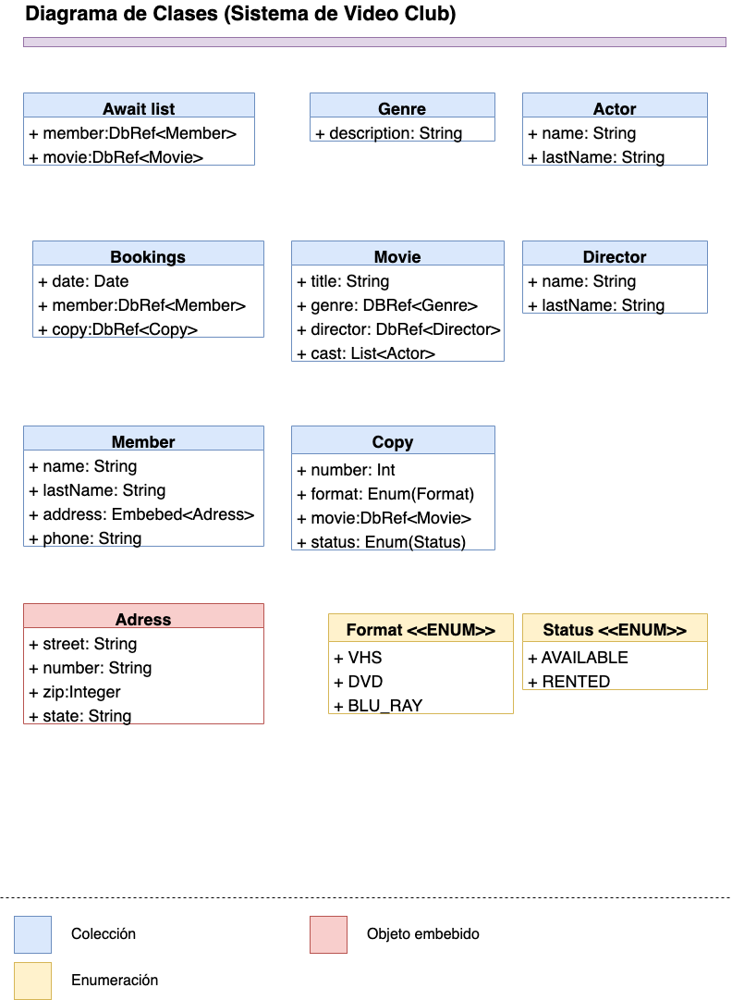

# Práctica | Mi primera API con express + ORM

## Getting Started

Vamos a construir todos los servicios web relacionados con el ejemplo del video club, basado en el modelo entidad - relación cree para cada entidad todo su CRUD. Una vez terminado suba su proyecto a gitlab en una rama diferente a master. Suba la liga del proyecto una vez terminado.

### Prerequisites

    *node 
    *npm 
    *express

### Installing

1.Clona este respositorio 

    git clone git@gitlab.com:a353262/express-orm.git

2.Posicionate en la carpeta del proyecto 

    npm install

3.Para ejecutar el proyecto;
    
    npm run dev

## Built With

* node 
* npm
* express

## Authors
Anahí Peinado Villalobos 353262

## License

No cuenta con licencia

## Acknowledgments
* I.S Luis Antonio Ramírez Martínez 
